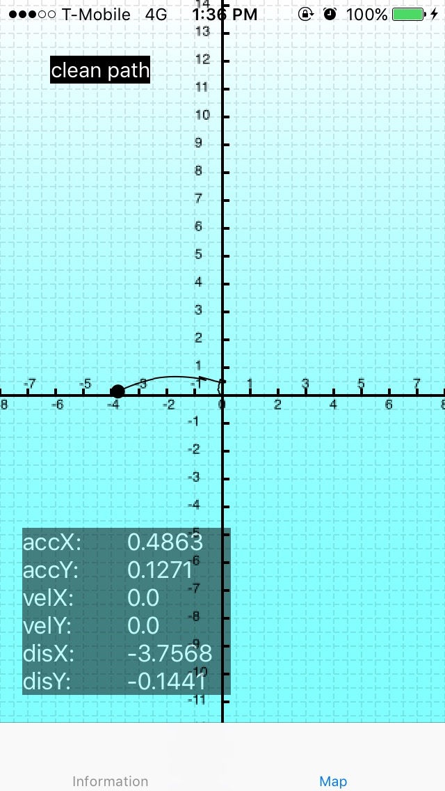
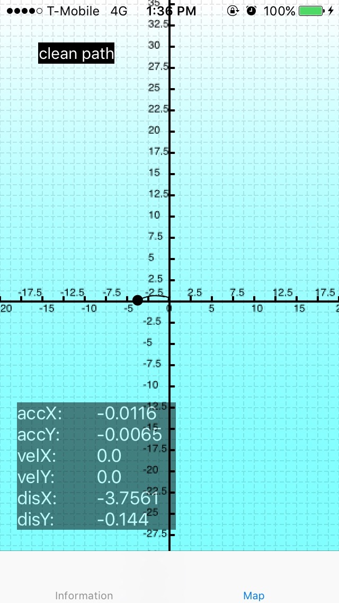
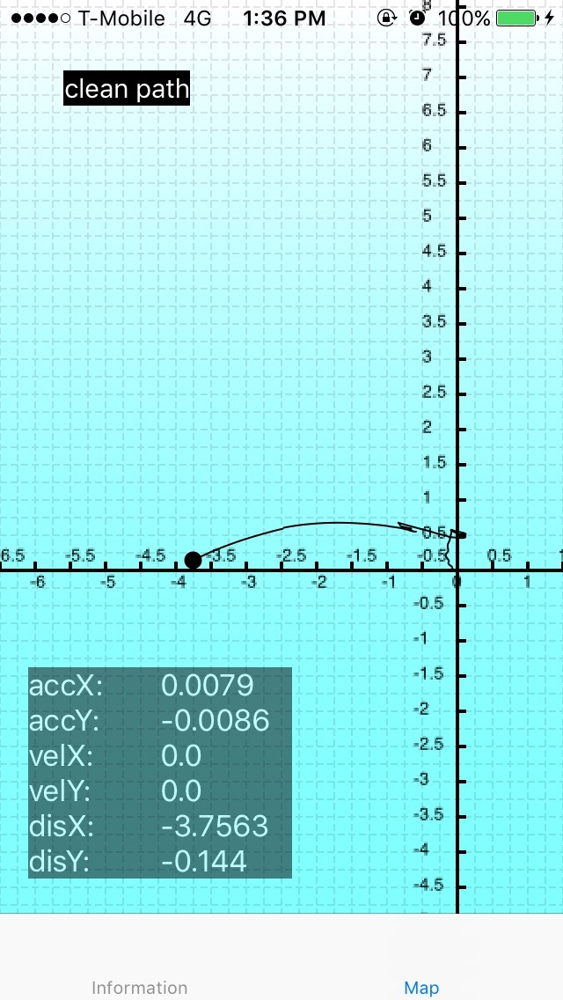

# Indoor-accelerometer-localization
Project at Focus Universal (iOS- swift)

### Feature included:
- Display Acceleration Data in Realtime.
- Display Velocity Data in Realtime.
- Display Distance Data in Realtime.
- Display Direction Data via Megnetic Sensor in Realtime.
- Visualize 2D Movement in Realtime.

### Two kinds of user interface: 
</img>
</img> 

### Map Interface:
- Visualize 2D movement 
</img> 
- Zoom in, Zoom out and Origin shift 
   </img></img>    </img></img> 

